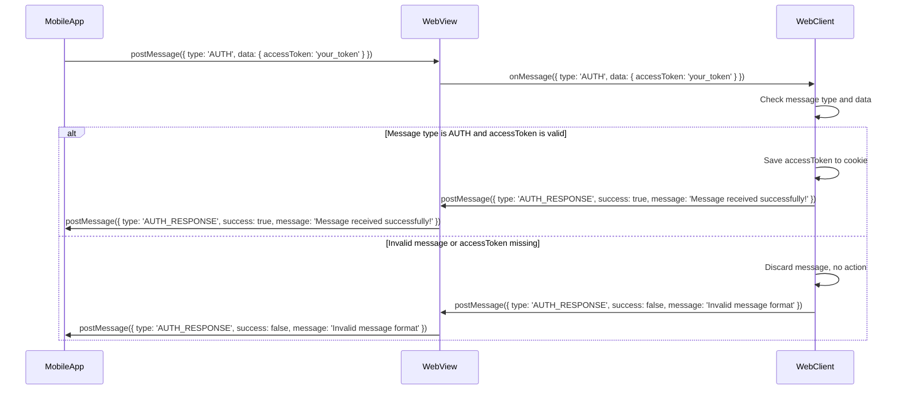

# React Native WebView Authentication Project

[](https://github.com/user-attachments/assets/6805395d-5fc7-49be-9954-da711897a814)

## Description
This project is a React Native application focused on establishing communication between a website and a mobile application using WebView. The primary goal is to bypass the web's authentication system, allowing the current user to access and complete a form embedded in the website.

**Key Features:**
- Seamless integration of a vspace web form within a React Native mobile app via WebView.
- Handles web authentication, enabling the user to interact with authenticated content directly.
- Secure communication between the mobile app and the website to ensure data privacy and integrity.

## Flow


## Code
> **Important ‼️** Communication cross platform (web and mobile) is using Webview, and rule form submission is dependent on submission accessability is restricted or public, when form is restricted we need send current user jwt `accessToken` into web. Choosing [`postmessage`](https://developer.mozilla.org/en-US/docs/Web/API/Window/postMessage) API is best way because it is more secured from query url param to send access token. Based on BE information token is related to one device, using webview will solve this rules.

```ts
// file: src/type.ts
/**
 * Post message payload for authentication
 */
export type AuthPostMessagePayload = {
  type: 'AUTH';
  /**
   * Authentication jwt token from mmkv
   */
  data: Record<'accessToken', string>;
}

/**
 * Post message response for authentication
 */
export type AuthPostMessageResponse = {
  type: 'AUTH_RESPONSE';
  /**
   * Success status of the authentication
   */
  success: boolean;
  /**
   * Error message if any
   */
  message: string;
}
```

```tsx
// src/WebViewScreen.tsx
function WebViewScreen({ route }: WebViewScreenProps) {
  const { submissionUrl } = route.params;
  const webViewRef = useRef<WebView>(null);

  const accessToken = useSpaceStore.use.accessToken();

  /**
   * Handle the webview load event
   * Post a message to the webview with the access token
   */
  const handleOnLoad = useCallback(() => {
    if (!accessToken) {
      return toast.error('Access token not found', {
        position: ToastPosition.BOTTOM,
        isSwipeable: true,
      });
    }
    const message: AuthPostMessagePayload = {
      type: 'AUTH',
      data: { accessToken },
    };
    const payload = superjson.stringify(message);
    webViewRef.current?.postMessage(payload);
  }, [accessToken]);

  /**
   * Handle message from the webview
   */
  const handleMessage = (event: WebViewMessageEvent) => {
    // Check if the message is coming from the expected origin
    // Replace 'https://virtualspace.ai/' with your app's actual scheme
    // if (event.origin !== "https://virtualspace.ai/") return;
    const eventData = JSON.parse(event.nativeEvent.data) as AuthPostMessageResponse;
    if (eventData.type !== 'AUTH_RESPONSE') {
      return;
    }
    if (eventData.success) {
      return toast.success('Authentication successful', {
        position: ToastPosition.BOTTOM,
        isSwipeable: true,
      });
    }
    return toast.error('Authentication failed', {
      position: ToastPosition.BOTTOM,
      isSwipeable: true,
    });
  };

  return (
    <View style={styles.container}>
      <WebView
        ref={webViewRef}
        source={{ uri: submissionUrl }}
        onMessage={handleMessage}
        onLoadEnd={handleOnLoad}
      />
    </View>
  );
}
```

## Requirements
```txt
node >= 18 or bun >= 1
react-native 0.75.3
Xcode (for iOS development) >= 15.x
Android Studio (for Android development) with Android SDK >= 29
CocoaPods (for iOS dependency management) >= 1.14
Java Development Kit (JDK) >= 11
```

## Structure
```txt
.
├── app.json
├── App.tsx
├── babel.config.js
├── bun.lockb
├── Gemfile
├── Gemfile.lock
├── index.js
├── ios
├── jest.config.js
├── metro.config.js
├── node_modules
├── package.json
├── README.md
├── src
│  ├── FormSubmissionScreen.tsx
│  ├── LoginScreen.tsx
│  ├── services
│  │  ├── auth.ts
│  │  ├── axios.ts
│  │  ├── type.ts
│  │  └── workspace.ts
│  ├── type.ts
│  ├── types
│  │  ├── user.ts
│  │  └── workspace.ts
│  ├── utils
│  │  ├── schema.ts
│  │  └── store.ts
│  ├── WebViewScreen.tsx
│  └── WorkspaceListScreen.tsx
└── tsconfig.json
```
